# Pump it Up: Data Mining the Water Table

## Problem Description
This is a multi-class classification problem regarding water pumps in Tanzania, where the goal is to classify water pumps’ status either as: "functional", "needs repair", or "nonfunctional". The data is provided by the Tanzanian Ministry of Water. If a good statistical model is built, pump maintenance can be improved, which would lead to better access to water.

## Exploratory Data Analysis, Preprocessing
We started by exploring the dataset and performing basic data cleaning and preprocessing steps. The training data set contains 59,400 observations with the labels and the test set contains 14,850 observations (without the labels).

In training data set there were several number of numerical columns containing high number of zero values. So, we decided to handle zero values using categorical location-based data columns like “subvillage”, “lga” and ward etc. These location columns had high cardinality, therefore after imputation of numerical location-based data columns we dropped some of the categorical locations columns because of two main reasons; (1) categorical data is required to be encoded into multiple binary columns thus would hinder the performance of the model (2) having a numerical longitude/latitude data would yield the same result therefore, would cause redundancy.

### Categorical Features

#### Longitude, Latitude, and GPS

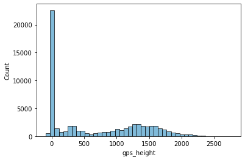 
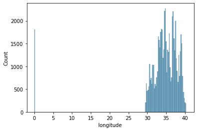

In longitude and gps_height columns there were high number 0 values. For Tanzania, these geographical values can not be 0. Whereas in latitude column, there were data points lying outside of Tanzania, on the ocean. Thus, zero and improper latitude values are replaced by NaN and then imputed by using mean value of each column for each unique grouping of 'basin', 'region', 'lga', 'ward', ‘subvillage’ variables.

After value imputation, gps_height plot shows that in lower heights of Tanzania the ratio of non functional pumps are higher than higher ratios. The functionality between 1000 and 2000 is better.

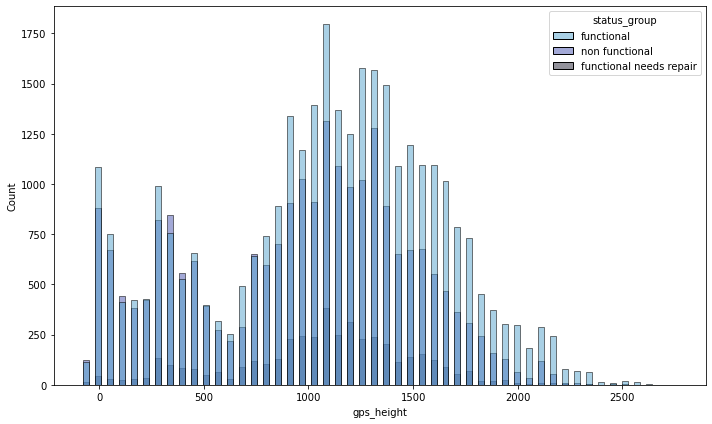

#### Mapping Coordinates
Creating a scatter plot with longitude and latitude, we can see that the number of functional water pumps is higher in some areas, while in some areas it is less, in some areas there are no records at all. The regions, latitude, longitude and gps height is in relation with pump functionality.

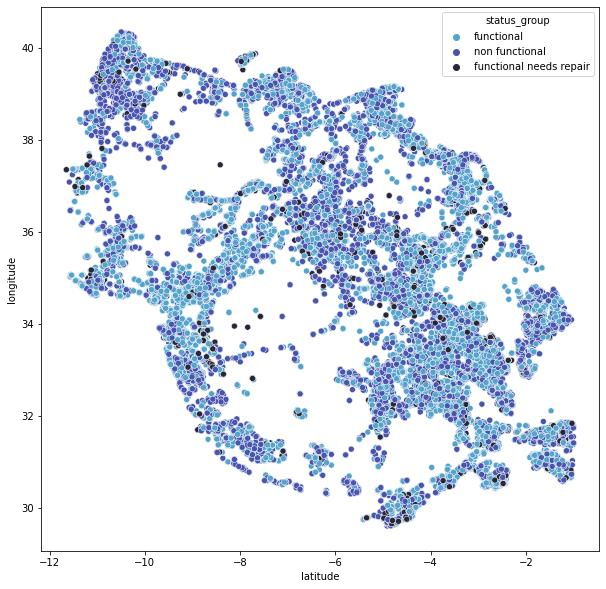

#### Construction Year
To handle missing values in this column, computed probability distribution of construction year and replaced missing values with random samples drawn from the normalized probability distribution and categorized all values to decades at the end.

Not surprisingly, the older pumps have a higher ratio in non-functioning pumps compared to the newer water pumps. Beside, more than half of the water pump are constructed last 20 years.

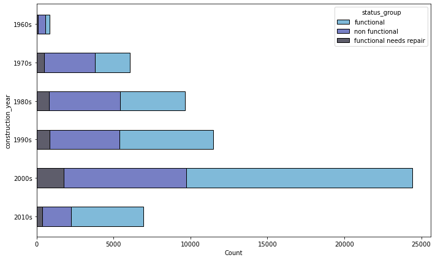

#### Population
In population, several observations had missing values. Similar to the method stated for longitude-latitude-gps_height above, missing values are replaced using the mean value of each column for each unique combination of 'basin', 'region', 'lga', 'ward', ‘subvillage’ variables.

### Categorical Features

#### Quantity Group
The distribution of classes among variables are relatively even, except dry and unknown water pumps are largely non-functional.

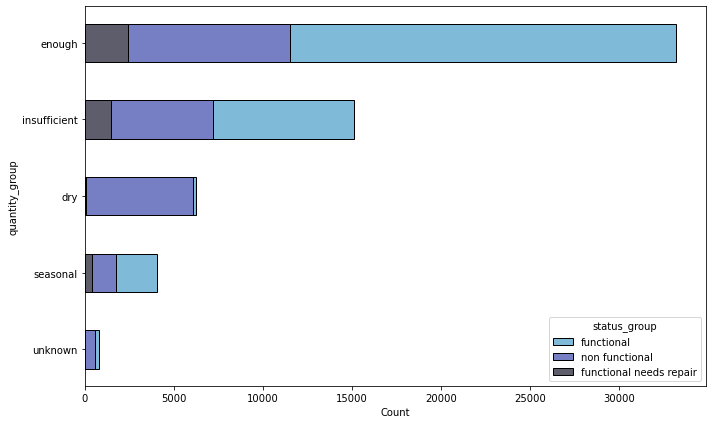

#### Quality Group
Over 50k of waterpumps has good quality of water. However, people can not reach this quality type due to half of these type has non-functional waterpump. Unlike the others, the rate of non-functional waterpumps in unknown variable is very high.
Figure 8: Bar chart of quality group in training dataset, grouped by pump status.

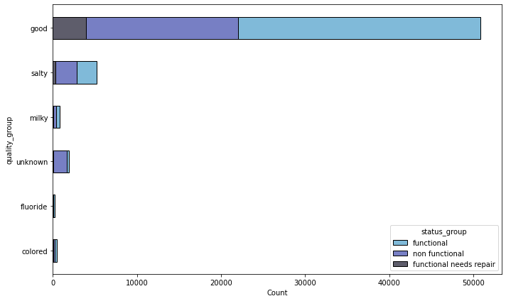

#### Waterpoint Type
According to waterpoint types of water pump, other class have too much more non-functional pumps than functional. Almost half of waterpoint_type is communal standpipe and more than half of this type is functional.

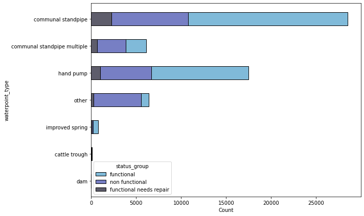

#### Source Class
The distribution of classes among all variables are relatively even. But, nearly 50k of water pumps uses groundwater.

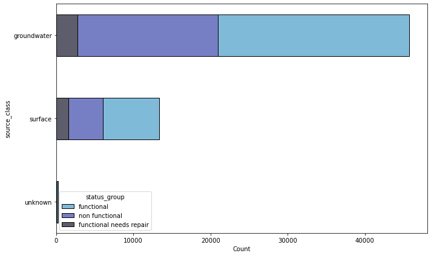

#### Extraction Type
According to extraction types of water pump, other and mono class may not good maintained and they have too much more non-functional pumps than functional. Almost half of extraction class is gravity and there are mostly funcitonal waterpumps.

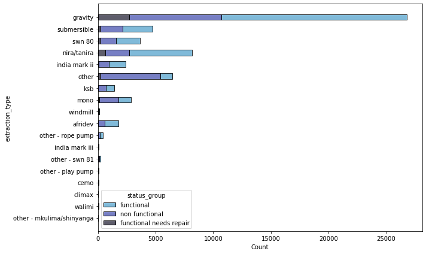

#### Recorded Date
We extractad record month from date_recorded column to see season effect. And, the ratio of functional water pumps in spring season records is slightly higher than other months. It may be a proof of season effect in records. To observe this in the analysis, we separated the date data into three numerical columns of DD-MM-YYYY.

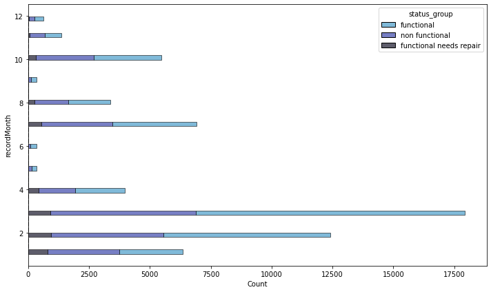

#### Payment
We converted payment data to binary where never pay is 0, and other cases as 1 for ease of analysis. The ratio of functional water pumps with payment is higher than no payment.
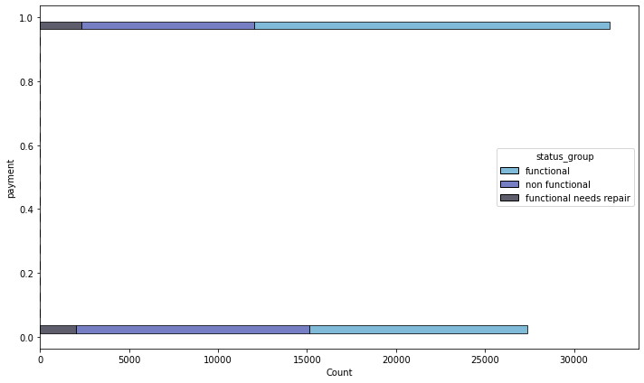

#### Permit, Public meeting, Scheme Management
Permit, Public Meeting, Scheme_Management columns seems to have 5-6% missing. “scheme_management” , “permit”, “public meeting” were highly correlated with management with a few exceptions. Therefore, they are grouped by management and filled by respective group’s mode. At the end, permit and public meeting are binarized and false columns were dropped.

Scheme management and public meeting columns have imbalanced distribution.

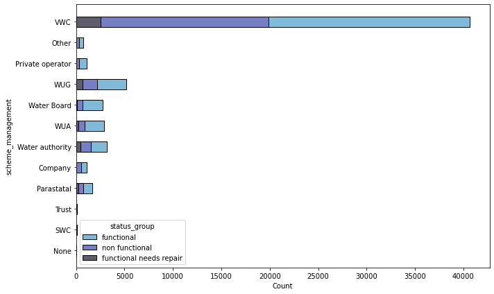

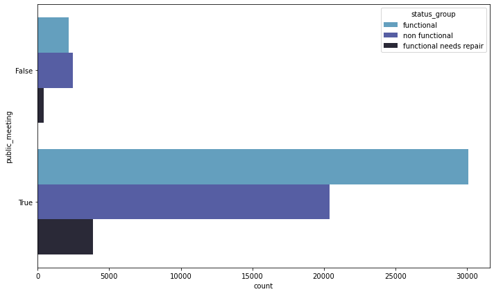

--------------------------------------------------------------------------
## Feature Selection
Some of the columns stated below are dropped for different reasons:

* Subvillage column is only 0.6% missing. But it is a categoric varibale with high cardinality. Longitude, Latitude and GPS Height columns were imputed by the help of this and other categoric location based columns ('subvillage', 'ward', ‘region’, ‘basin’, ‘lga’..) and also a high cardinality column at the end would yield numerous encoded columns therefore this and other categoric location columns ('subvillage', 'ward', ‘region’, ‘basin’, ‘lga’..)were removed.

* 'recorded_by' only has 1 unique value, would have no effect on the model and therefore removed.

* Some columns had very high number of unique values (high cardinality) and would hinder model consistency: 'funder', 'installer', 'lga', 'scheme_name', 'subvillage', 'ward', 'wpt_name'.

* Amount_tsh is 70% empty, num_private 98.7% empty therefore will be removed.

* Construction_year will be dropped since it is divided into seperate columns.
* Extraction_type and extraction _type_group are omitted since same as extraction_type_class.

* WaterQuality/Quality Group , Quantity/Quantity group, Management/Management Group, Region/RegionCode, Source/SourceType/SourceClass, WaterpointType/Group, Payment/PaymentType repetitions are dropped.
* Scheme_name dropped considering that 47% missing data.

* At the end we have columns of :
'id', 'gps_height', 'longitude', 'latitude', 'region_code',
'district_code', 'population', 'public_meeting', 'scheme_management',
'permit', 'extraction_type', 'payment', 'quality_group',
'quantity_group', 'source_class', 'waterpoint_type'
'recordMonth'.
Dummifying categorical variables:
End of the preprocessing, we dummified features that can be used in models due to dataset contains categorical variables. Binary columns’ false dummies were dropped.
--------------------------------------------------------------------------
## Model Assesment
After engineering our features, we have trained and evaluated various classification models to see which one performs best on the data. Trained models are based on; K-Nearest Neighbors (i.e. KNN) model, Logistic Regression, Random Forest, Random Forest with Grid-Search, and Gradient Boosting Classifier.

* Accuracy of each model is stated below:
* Random Forest Classifier = 0.80
* XGBoost = 0.78
* Gradient Boosting Classifier = 0.74
* Logistic Regression = 0.71
* KNN = 0.52

### Random Forest Classifier

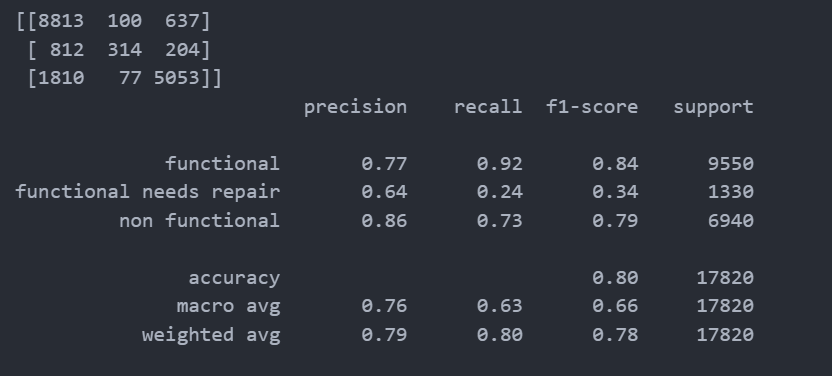

Figure 17: Classification report of Random Forest Classifier model.
We have trained a Random Forest Classifier model having maximum depth of the trees in the forest to 20, and used it to make predictions on the test data. In this case, our output showed the accuracy of the test set as 80%, achieving our best test accuracy score at all.
### Conclusion
To sum up, we carefully explored and preprocessed the data, engineered informative features, and experimented with different classification models to see which one works best for this particular problem. Our best model, Random Forest Classifier, predicted the functionality of the pumps with an accuracy of 80%.